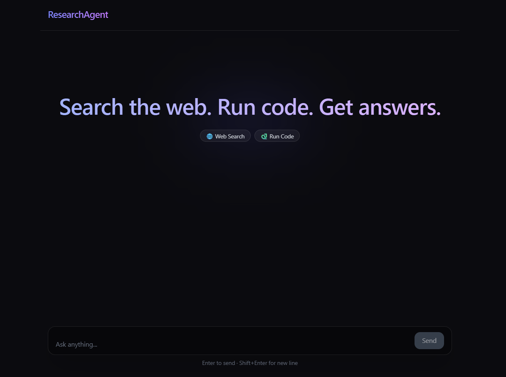

# ResearchAgent 🔬🤖
An autonomous multi-agent AI research system that routes each query to the most suitable specialist agent.

## Architecture

```text
User Query
    |
    v
+------------------+
|  Router (LLM)    |
| web | code | gen |
+------------------+
   |        |      \
   |        |       \
   v        v        v
Web     Code      General
Agent   Agent      Agent
   |        |         |
   |        |         |
   v        |         |
Quality Check Loop    |
   |                  |
   | sufficient?      |
   |---- yes ---------|
   |                  |
   | no               |
   v                  |
Refine + Re-search    |
(max 3 iterations)    |
   |                  |
   +--------->--------+
             |
             v
       Response Synthesizer
             |
             v
         Final Answer
```

## Features

- 🧠 Intelligent query routing across three specialist agents.
- 🌐 **Web Researcher** using Tavily search for current events and real-time data.
- 🐍 **Code Analyst** using Python REPL for calculations, data analysis, and plotting.
- 📚 **General Agent** for reasoning, explanations, and broad knowledge tasks.
- ✅ Adaptive quality-check loop that can refine and re-run web research up to **3 times**.
- ⚡ FastAPI backend with a React + Vite frontend chat interface.

## Tech Stack

| Layer | Technologies |
|---|---|
| Backend | Python, FastAPI, LangGraph, LangChain, OpenAI GPT-4o, Tavily |
| Frontend | React 19, Vite, Tailwind CSS v4 |

## Getting Started

### 1) Clone the repository

```bash
git clone <your-repo-url>
cd Research-agent
```

### 2) Backend setup

```bash
python -m venv venv
venv\Scripts\activate
pip install -r requirements.txt
uvicorn backend.main:app --reload --port 8000
```

Backend runs at: `http://127.0.0.1:8000`

### 3) Frontend setup

```bash
cd frontend
npm install
npm run dev
```

Frontend runs at: `http://localhost:5173`

### 4) Environment variables

Create `backend/.env` with:

```env
OPENAI_API_KEY=your_openai_api_key
TAVILY_API_KEY=your_tavily_api_key
PORT=8000
```

## Usage Examples

### A) Web Researcher (real-time information)

**Example query:**  
`What are the latest major AI policy updates announced this week?`

**Expected route:** `web`


### B) Code Analyst (computation / analysis)

**Example query:**  
`Load this sample dataset and show summary statistics with a histogram.`

**Expected route:** `code`


### C) General Agent (reasoning / knowledge)

**Example query:**  
`Explain the difference between supervised and unsupervised learning with practical examples.`

**Expected route:** `general`


### Interface Preview



## Project Structure

```text
Research-agent/
├─ backend/
│  ├─ main.py
│  ├─ .env
│  ├─ uploads/
│  └─ agent/
│     ├─ graph.py
│     ├─ router.py
│     ├─ specialisits.py
│     ├─ tools.py
│     ├─ state.py
│     ├─ agent.py
│     └─ __init__.py
├─ frontend/
│  ├─ package.json
│  ├─ public/
│  │  ├─ interface.png
│  │  ├─ web example.png
│  │  ├─ code example.png
│  │  └─ general example.png
│  └─ src/
│     ├─ App.jsx
│     ├─ main.jsx
│     ├─ index.css
│     └─ assets/
├─ requirements.txt
└─ README.md
```
